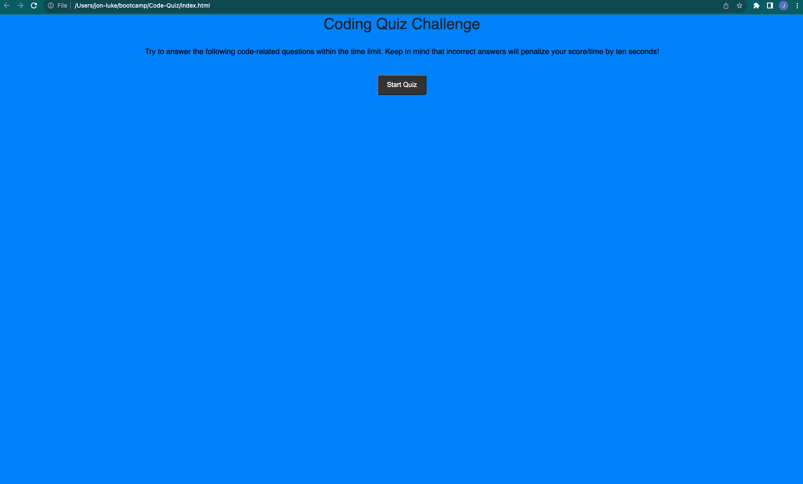

# Code-Quiz-

## Description

My movtivation for this project was to create a Java Script code quiz to help bootcamp students study.
This will help bootcamp students study and learn Javascript.

In this project, I successfully implemented a code quiz application using HTML, CSS, and JavaScript. The application adheres to a set of user stories, providing a responsive and engaging experience for quiz-takers. The quiz initiates when the user clicks the "Start Quiz" button, and a timer begins counting down. Questions are presented one by one, with the ability to select answers. For incorrect responses, a penalty of ten seconds is deducted from the timer. The game concludes when all questions are answered or when the timer reaches zero. At the end, users are prompted to enter their initials, and their scores are saved in local storage. The application also features a high scores display, showcasing the top five scores. The UI is designed for clarity and user-friendly interaction, and the visual elements, such as the animated clock icon and color schemes, contribute to an enjoyable user experience. This project demonstrates proficiency in structuring and styling web applications, handling user interactions, and managing data storage.

## Installation

N/A

## Usage

To use the JavaScript code quiz, follow these steps:

Access the Quiz:
Open the HTML file in a web browser. This can be done by double-clicking the HTML file or by hosting it on a web server.

Start the Quiz:
On the start screen, read the instructions, and click the "Start Quiz" button to initiate the quiz.

Answer Questions:
For each question presented, select your answer from the multiple-choice options. Clicking on an option will reveal whether your choice was correct or not.

Feedback and Scoring:
Receive instant feedback after each question. Correct answers contribute to your score, while incorrect answers result in a time penalty. The animated clock icon visually represents the countdown.

Game Over:
The quiz ends when all questions are answered or the timer reaches zero. The final score is displayed on the end screen.

Save Your Score:
Enter your initials in the input field provided on the end screen and click the "Submit" button to save your score. The high scores container displays the top scores achieved.

Try Again:
If you wish to retry the quiz, click the "Try Again" button to reset the quiz and start over.

View High Scores:
The "High Scores" section showcases the top scores obtained by participants, providing a competitive and engaging aspect to the learning experience.

This quiz is designed to be user-friendly and interactive, making it an enjoyable way to assess and enhance your JavaScript knowledge.

## Links

Link to Deployed App: (https://jlj98.github.io/Password-Generator-/)

## Credits

In the development of this quiz application, I utilized external sources for enhancing JavaScript functions and implementing CSS styling, drawing insights from resources such as ASKBCS, Xpert Learning Assistant, ChatGPT, and YouTube to ensure a comprehensive and effective implementation.

## License

Please refer to the LICENSE in the repo.
